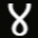

  <a target="_blank" href="https://webtree.shaniweb.com/" > 
    
  <a/> 
  <a target="_blank" href="https://webtree.shaniweb.com/" > 
      <h2 align="center"> Webtree ४ </h2>
  <a/> 

 

  <h2 align="center">Your Development Resource Hub(130+ websites in 15+ categories
    <a target="_blank" href="https://webtree.shaniweb.com/" > Live link <a/> 
  </h2>

 

# 🎯 What is WebTree? 👇
WebTree is a collection of development resources, built for developers who are tired of juggling alot of tabs and endless Google searches.
It acts like a single command center for everything you need to design and build beautiful web interfaces.

 
 

# 🤔 Why does WebTree exist? 👇
 

## 🧠 The problem it solves:

You open 10–20 tabs trying to find the right fonts, icons, SVGs, color palettes, UI kits, and animations.

You keep bookmarks spread across browsers, folders, and apps, and still can’t find what you need quickly.

Design inspiration and dev tools feel scattered and noisy instead of organized and focused.

 

## 💚 The idea behind WebTree:

“One place to find the best, no fluff, no random links.”
Instead of hunting everywhere, you land on WebTree and instantly discover high‑quality, pre‑filtered resources that actually help you ship faster.

 
 

# 🧩 How is WebTree useful? 👇
 
## ✨ For developers & designers:

You save time by skipping endless tab‑hopping and SEO‑driven junk.

You get curated picks (not random links), so you can trust that the resources are actually good and usable.

You can explore inspiration in one place: UI components, Animations, SVGs, color systems, 3d, API, Illustration and more.

  

## 🚀 For side‑projects and freelancing:

You can prototype and build faster with ready‑to‑use assets.

You reduce the “what design system should I use?” fatigue because you can quickly see what’s available and what fits your style.

 
 

# 🎯 What services / features do you get? 👇
 

## 🗂️ Curated resource library

Fonts, icons, SVGs, illustrations, and more for UI building.

UI kits, component libraries, and design patterns you can reference or adapt.

Animation libraries, motion‑design tools, and micro‑interaction inspiration.

 

## 📊 Clean, single‑page experience

Minimal, fast‑loading layout so you can browse without scroll fatigue.

Smooth micro‑animations/interactions with visual feedback to keep the experience feel modern and playful.

 

## 💡 Design‑dev friendly structure

Resources grouped by category (e.g., “Fonts”, “Icons”, “Motion”, “UI Kits”).

Easy to scan and jump to the section you need at that moment.

 
 

# 🧭 Problem statement (in simple words) 👇
 

## 📌 The core problem:

“There’s no single, clean, developer‑friendly place that collects only the best development resources in one view.”

 

## 🔧 What WebTree does about it:

Aggregates the most useful tools and assets across 15+ categories from the web.

Filters out low‑quality, outdated, or overly promotional links.

Presents everything in a single, scroll‑free, responsive page so you can focus on building, not searching.

 

# 🚀 In one line…
WebTree is your one‑stop development playground – less searching, more making. 🚀
- Home link - https://webtree.shaniweb.com

